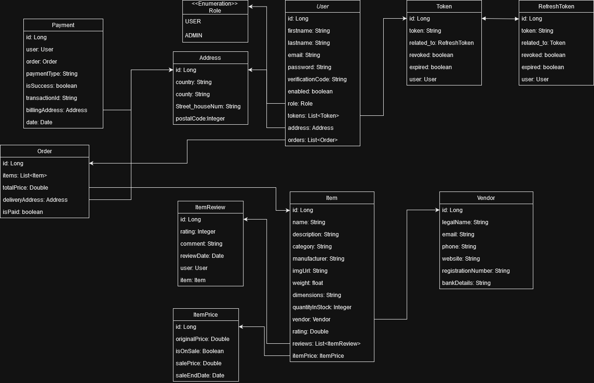

# Webshop
English description
for Hungarian, check below

Hungarian description
Ez a backend tartalmaz egy Springboot API-t amin keresztül lehet regisztrálni, bejelentkezni, és validálni a kéréseket felhasználó rang alapján (role-based authentication).
Az webshop Itemek megtekintéséhez nem kell authentikáció. Webshop itemeket(árut) az admin felhasználók tudnak készíteni (Lehet már bővítettem a jövőben többrétegű jogosultságrendszerrel).
A Security Backbone az a https://github.com/ali-bouali/spring-boot-3-jwt-security projekt alapján lett elkészítve, ezt használtam "váznak" és bővítettem extra check-ekkel.
A backend Bearer token-es validációt hajt végre a backend minden olyan kérésére amelyhez kell authentikáció. A tokenek egy napig érvényesek, 1 évig érvényes egy refreshtoken.
Ha valami user detail változásra kerül pl rang, akkor az access token invalidálódik, és a refresh tokennel lehet kérni új access tokent. Ekkor az access tokennel jön a frissített adat.

Angular:
Token interceptor: Minden requesthez ami követel authentikációt, hozzá teszi ezt a jwt bearer access tokent a headerbe, és úgy viszi ki a requestet.
HA: 401 státusz reject jön amit dob is a szerver ha invalid a token, akkor refresh-token-re küld egy kérést az adott refresh-tokennel, majd a kapott új access-tokennel is megkisérli az adott requestet. Ha nem sikerült kapni refresh-tokenről új tokeneket, akkor törlődik minden a user-ről és újra be kell jelentkezni

Ezt a részt bővíteni a shoppal, eddig még csak a felhasználók vannak meg

